# Trailidea

Trailidea is a modern web application designed for hiking and trekking enthusiasts to share experiences, discover trails on an interactive global map, and engage with the community. 

It features an AI-powered assistant (DeepSeek integration) to help users write better posts and get instant answers about hiking, as well as a robust administrative dashboard for user and content moderation.

## Live Demo
- **Frontend (Vercel):** [https://trailidea.vercel.app](https://trailidea.vercel.app)
- **Backend (Render):** [https://trailidea-web.onrender.com](https://trailidea-web.onrender.com)

## Developer Details
- **Name:** Kamlesh Kumar Sah
- **Batch:** 36B
- **Coventry ID:** 15372633
- **College ID:** 240152

---

## Features Showcase & Screenshots

### 1. Global Feed
Discover posts and experiences from other hikers globally.
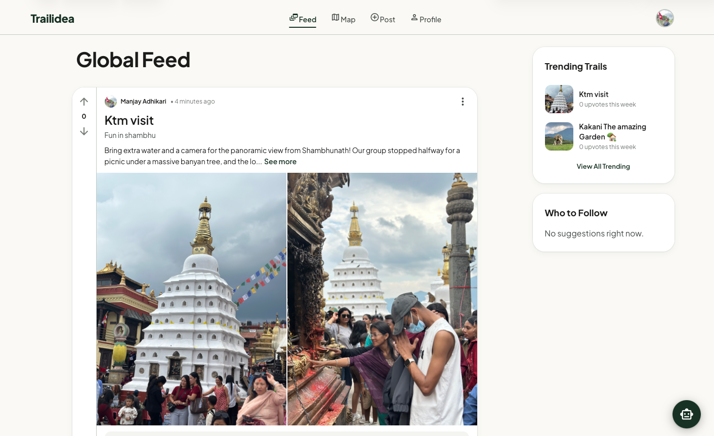

### 2. Interactive Map
Find posts and trail reports pinned exactly where they happened on a fully interactive map.
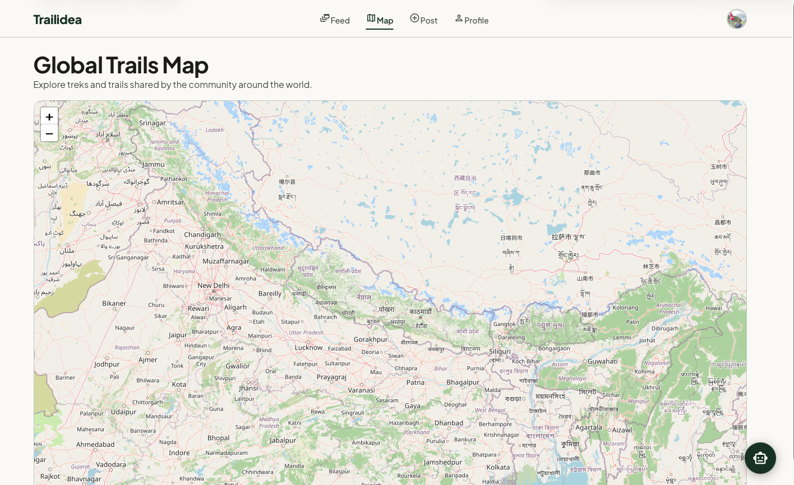

### 3. AI Capabilities
**AI Post Suggestion**
Get intelligent suggestions for your post descriptions based on your title.
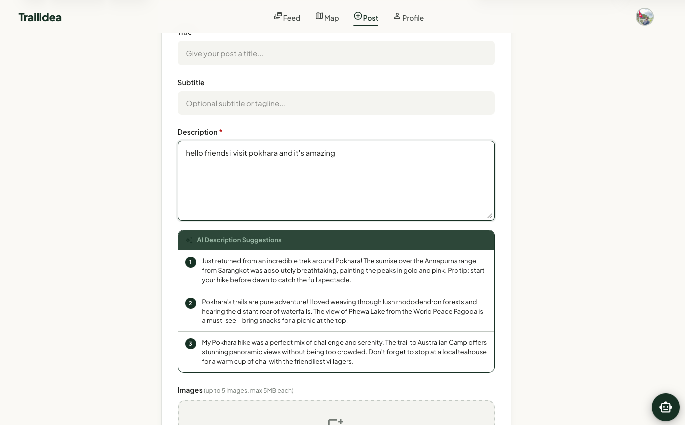

**AI Chatbot Assistant**
A dedicated hiking assistant chatbot to answer all your trekking questions.
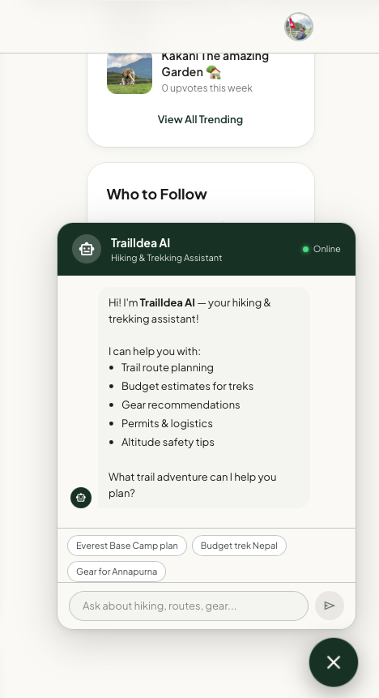

### 4. User Profile & Post Creation
Users can customize their profiles and create rich posts with multiple images.
- **Profile:** 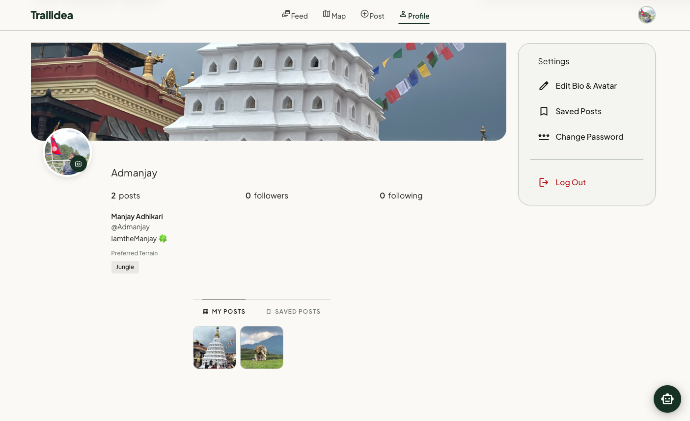
- **Update Profile:** 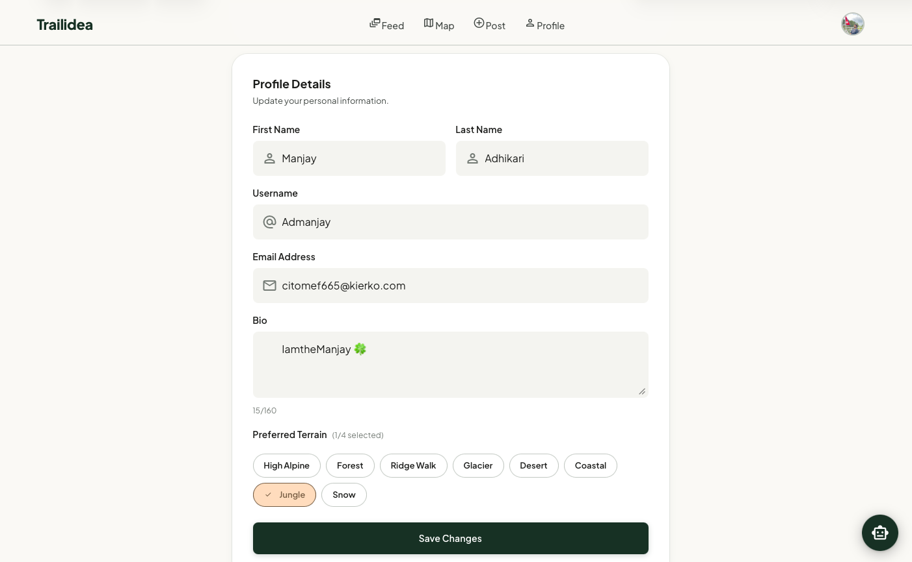
- **Post Creation:** 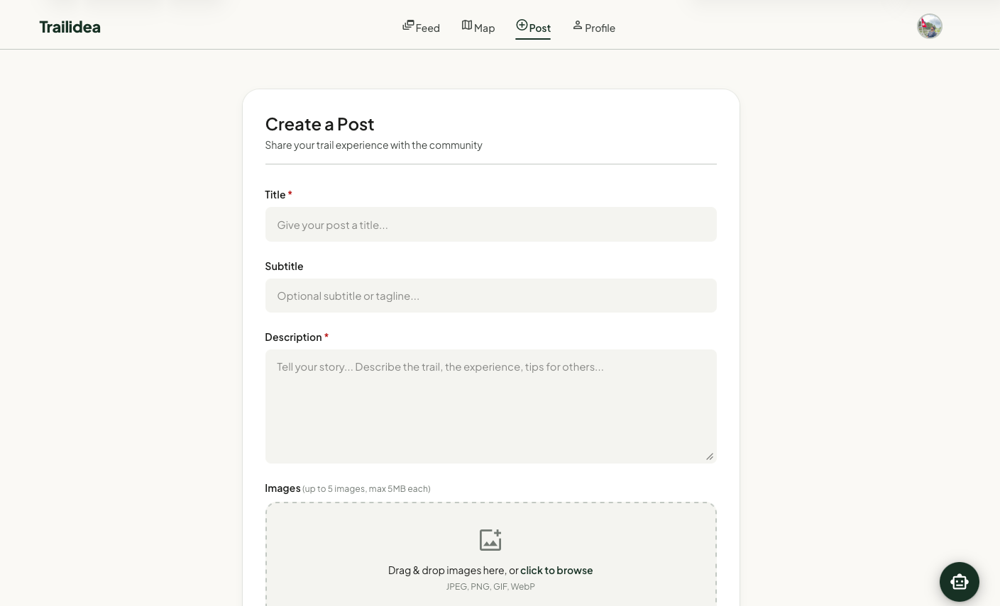

### 5. Admin Dashboard
A comprehensive dashboard for platform administrators to monitor analytics, manage users, and moderate content.
- **Admin Overview:** 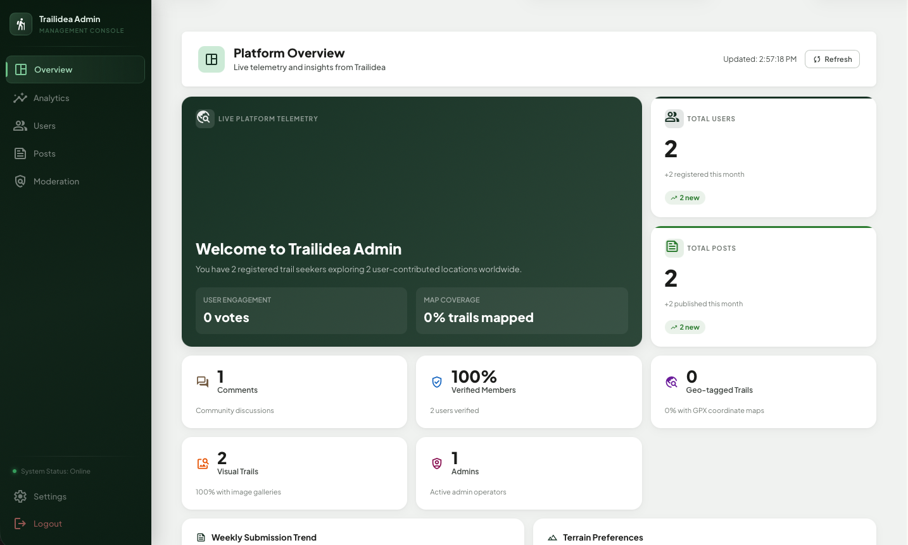
- **Analytics:** 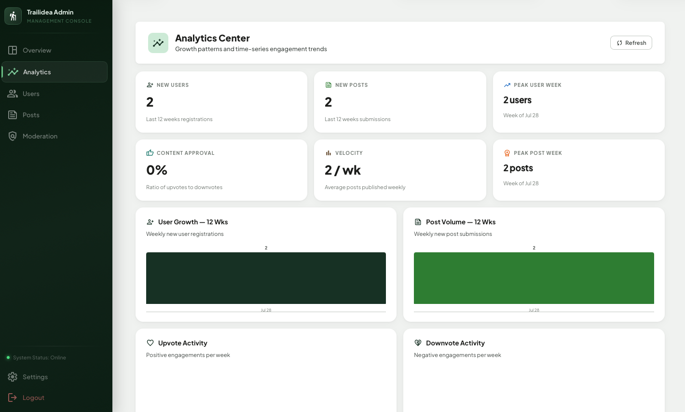
- **User Directory:** 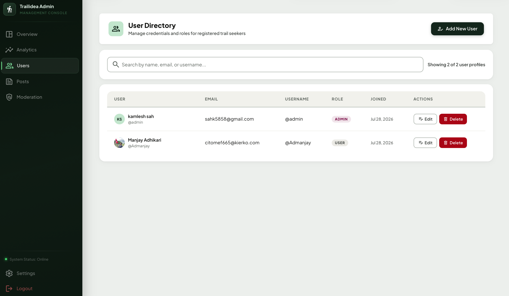
- **Post Management:** 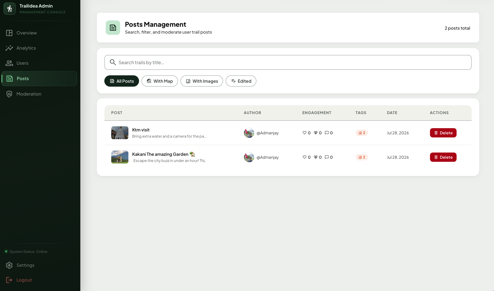
- **Moderation Tools:** 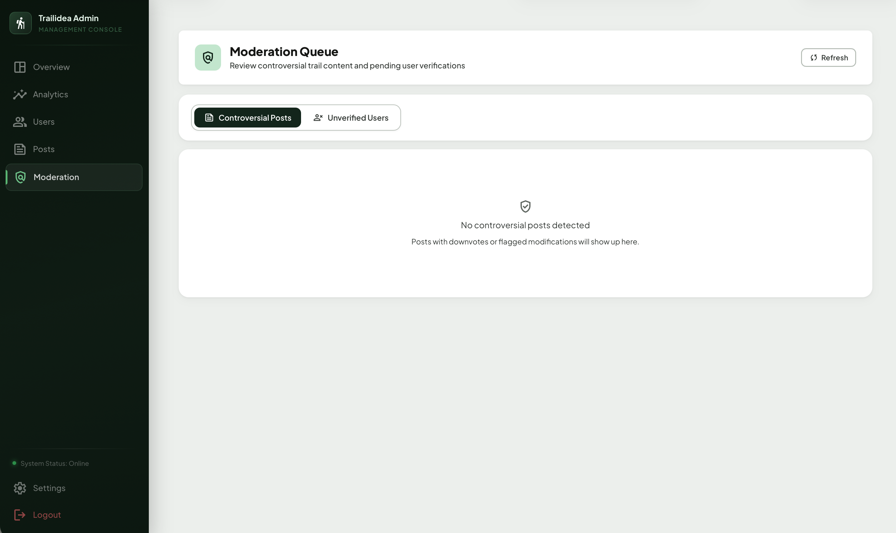

---

## Technology Stack
- **Frontend:** Next.js (App Router), React, TailwindCSS, React-Leaflet
- **Backend:** Node.js, Express, MongoDB, Mongoose
- **AI Integration:** DeepSeek API
- **Deployment:** Vercel (Frontend), Render (Backend)

